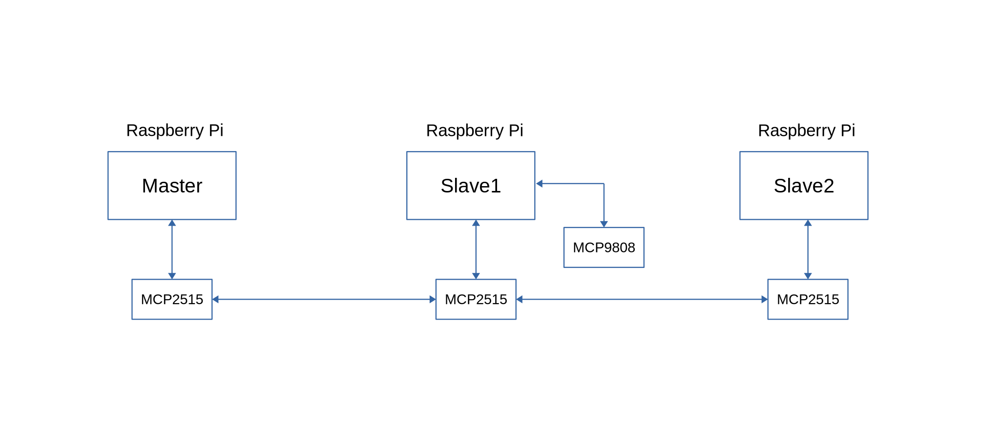

# m2m-can

[](https://www.npmjs.com/package/m2m-can)


**m2m-can** is a basic can-bus library based on SocketCAN using a simple and easy API. Open and connect the can interface to the can-bus. Once connected, your device can start sending or receiving data to/from the can-bus.    

1. [Supported devices](#supported-devices)
2. [Node.js version requirement](#nodejs-version-requirement)
<!--3. [Setup can-bus (using MCP2515 CAN module) on Raspberry Pi](#can-bus-setup)-->
3. [Setup Raspberry Pi to use can-bus (using MCP2515 CAN module)](#can-bus-setup)
4. [Installation](#installation)
5. [Quick Tour](#quick-tour)

## Supported devices

* Raspberry Pi Models: B+, 2, 3, Zero & Zero W, Compute Module 3, 3B+, 3A+, 4B (generally all 40-pin models)

## Node.js version requirement

* Node.js versions: 10.x, 11.x, 12.x, 14.x, 16.x. Ideally the latest LTS version.

## Installation
```js
$ npm install m2m-can
```

###  Raspberry Pi peripheral access (GPIO, I2C, SPI and PWM). <a name="rpi-peripheral-access"></a>
For projects requiring raspberry pi peripheral access such as GPIO, I2C, SPI and PWM, you will need to install *array-gpio* module.
```js
$ npm install array-gpio
```

## Quick Tour


<!---->

On can-bus communication, each device should either be sending or receiving data to/from other devices on the network but not both.

### Master application

```js
'use strict';

const can = require('m2m-can');

let temp = null, random = null;

/* temperature can-bus device frame id */
const temp_id = '025';

/* random can-bus device frame id */
const random_id = '035';

/* master can-bus frame id or can node id */
const master_id = '00C';

/* open can0 interface, set bitrate to 500000 Hz */
// defaults to txqueuelen = 1000, rs = 100
can.open('can0', 500000, function(err){
  if(err) return console.error('can0 interface open error', err.message);
  // if can0 was opened successfully, you'll see an output - ip link set can0 up with txqueuelen 1000 and bitrate 500000 - success

  // read random frame data from CAN bus using the random_id
  can.read('can0', {id:random_id}, function(err, fdata){
    if(err) return console.log('can read error', err.message);
    console.log('can-random frame data', fdata);
    // { id: '035', len: 3, data: [ 12, 52 ], filter: '035', change: true }   
    // data[0] - integer value
    // data[1] - integer value    
    random = fdata.data[0].toString() + fdata.data[1].toString();
    console.log('random data', random); // 1252
  });

  // read temperature frame data from CAN bus using the temp_id
  can.read('can0', {id:temp_id} , function(err, fdata){
    if(err) return console.log('can read error', err.message);
    console.log('can-temp frame data', fdata);
    // { id: '025', len: 2, data: [ 18, 94 ], filter: '025', change: true }
    // data[0] - integer value
    // data[1] - fractional value    
    temp = fdata.data[0] + '.' + fdata.data[1];
    console.log('temperature data', temp); // 18.94
  });
});
```

### Slave1 application
```js
'use strict';

const can = require('m2m-can');
const r = require('array-gpio');

/* using the built-in MCP9808 chip library for capturing temperature data using i2c */
let i2c =  require('./node_modules/array-gpio/examples/i2c9808.js');

/* setup gpio output pins for led status indicator using array-gpio */
let led1 = r.out(33); // set gpio output pin 33 for can device status led
let led2 = r.out(35); // set gpio output pin 35 for data change status led

/* can-bus temperature device id */
const temp_id = '025';

can.open('can0', 500000, function(err){
  if(err) return console.error('can0 interface open error', err.message);

  led1.on();
  led2.off();

  // watch data changes in a cyclic mode
  // built-in within the watch method
  can.watch('can0', {id:temp_id}, (err, data) => { // watch interval defaults to 100 ms
    if(err) return console.error('can watch error', err.message);

    data.payload = i2c.getTemp();

    // if data value has changed, send data to CAN bus
    if(data.change === true){
      console.log('send temp data', data.payload);
      led2.pulse(200);
      can.send('can0', data.id, data.payload);
    }
    else{
      console.log('no data change');
    }
  });
});

```
### Slave2 application
```js
'use strict';

const can = require('m2m-can');
const r = require('array-gpio');

/* setup can bus device led status indicator using array-gpio */
let led1 = r.out(33); // can device status
let led2 = r.out(35); // data change status

// can-bus device random id
const random_id = '035';

can.open('can0', 500000, function(err){
  if(err) return console.error('can0 interface open error', err.message);

    led1.on();
    led2.off();

    can.watch('can0', {id:random_id}, (err, data) => {
       if(err) return console.error('can watch error', err.message);

       data.payload = 1010 + Math.floor(( Math.random() * 200) + 100);

       if(data.change){
         console.log('send random data', data.payload);
         can.send('can0', random_id, data.payload);
         led2.pulse(200);
       }
       else{
         console.log('no data change');
       }
    });
});
```
<br>

## Can-bus setup

<br>

### Pin Connection

**RPI GPIO Header**&ensp;&ensp;&ensp;&ensp;&ensp;&ensp;&ensp;&ensp;&ensp;**MCP2515 CAN Module**

**PIN**&ensp;&ensp;**NAME**&ensp;&ensp;&ensp;&ensp;&ensp;&ensp;&ensp;&ensp;&ensp;&ensp;&ensp;&ensp;&ensp;&ensp;**PIN**

#01&ensp;&ensp; 3.3V &ensp;------------------&ensp; VCC

#06&ensp;&ensp; GND &ensp;-----------------&ensp; GND

#19&ensp;&ensp; SPI_MOSI &ensp;----------&ensp; SI

#21&ensp;&ensp; SPI_MISO &ensp;----------&ensp; SO

#22&ensp;&ensp; GPIO25 &ensp;-------------&ensp; INT

#23&ensp;&ensp; SPI_SCLK &ensp;---------&ensp; SCK/CLK

#24&ensp;&ensp; SPI_CE0 &ensp;-----------&ensp; CS


<br>

<br>

1. Open the Raspberry Pi config.txt file using an editor.
~~~
$ sudo mousepad /boot/config.txt
~~~

&ensp;&ensp;or

~~~
$ sudo leafpad /boot/config.txt
~~~

2. Uncomment the following section to enable SPI.

~~~
dtparam=spi=on
~~~

3. Add the following as additional SPI setup.
~~~
dtoverlay=mcp2515-can0,oscillator=16000000,interrupt=25
~~~

4. Comment the following section. This is not needed.
~~~
# dtoverlay=spi0-hw-cs
~~~

5. Save the config.txt file. Reboot the Raspberry Pi.


6. Verify the SPI configuration. The CAN module should be initialized.
~~~
$ dmesg | grep -i spi
~~~
&ensp;&ensp;The result will look like as shown below.
~~~
[    8.544607] mcp251x spi0.0 can0: MCP2515 successfully initialized.
~~~
&ensp;&ensp;By the same command you can check the CAN module if it was started by default:
~~~
$ dmesg | grep -i can
~~~
&ensp;&ensp;The result will look like as shown below.
~~~
[    9.793497] CAN device driver interface
[    9.819174] mcp251x spi0.0 can0: MCP2515 successfully initialized.
[  271.563711] IPv6: ADDRCONF(NETDEV_CHANGE): can0: link becomes ready
[  271.695497] can: controller area network core
[  271.711043] can: raw protocol
~~~

&ensp;&ensp;If for any reason this is not the case, you can add the CAN module at system start:
~~~
$ sudo nano /etc/modules
~~~
&ensp;&ensp;Add "can" in a new line, save the file and reboot.

<br>

### Optional additional CAN utilities.
1. Install Linux can utility for SocketCAN (https://github.com/linux-can/can-utils).
~~~
$ sudo apt-get install can-utils
~~~

2. Set clock the speed.
~~~
$ sudo ip link set can0 up type can bitrate 500000
~~~

&ensp;&ensp;If the device is busy as shown below:
~~~
 $ RTNETLINK answers: Device or resource busy
~~~

&ensp;&ensp;Shutdown the CAN interface as shown below:
~~~
$ sudo ifconfig can0 down
~~~

&ensp;&ensp;And then restart it as shown below:
~~~
$ sudo ifconfig can0 up
~~~

3. Listen/Receive for any data in the CAN bus.
~~~
$ candump any
~~~

4. Send/Write some data to the CAN bus.
~~~
$ cansend can0 111#FF
~~~

5. Below are some examples.

&ensp;&ensp;Wrong CAN-frame format! Try:
~~~
<can_id>#{R|data}          for CAN 2.0 frames
<can_id>##<flags>{data}    for CAN FD frames
~~~
~~~
<can_id> can have 3 (SFF) or 8 (EFF) hex chars
{data} has 0..8 (0..64 CAN FD) ASCII hex-values (optionally separated by '.')
<flags> a single ASCII Hex value (0 .. F) which defines canfd_frame.flags

e.g. 5A1#11.2233.44556677.88 / 123#DEADBEEF / 5AA# / 123##1 / 213##311
     1F334455#1122334455667788 / 123#R for remote transmission request.
~~~

<br>
Links

can-utils https://github.com/linux-can/can-utils
